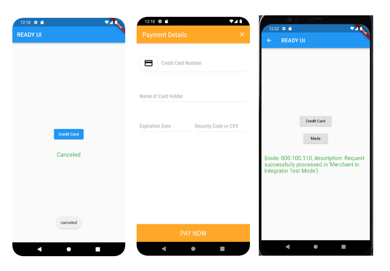

## 🤑 Hyperpay Flutter Integration 
This Application developed along with the guide https://medium.com/@ashwaqazan/hyperpay-integration-with-flutter-and-firebase-371b4c772141 to integrate hyperpay with flutter for android apps.

## ⚙ Tools/Tech Used
- Hyperpay Sdk
- Flutter
- Firebase Functions
- Kotlin "Android Native"

## ✨ Features
✔ Pay via mada, visa and mastercard in your Android phone using ready Hyperpay UI

## 🎬 Illustration
Here are some Illustration of App 

|   |
| :-------------------------------------: | 
|       Hyperpay Payment                  | 

## 💣Installation
- Clone the repo and follow the meduim guide to apply your desired edits or follow the guide to add hyperpay to your own project.
https://medium.com/@ashwaqazan/hyperpay-integration-with-flutter-and-firebase-371b4c772141

## ❤ THANKS!
Thank you for using this repo and please contact me for any support or collaboration E-mail: Ashwaqazan@gmail.com.
